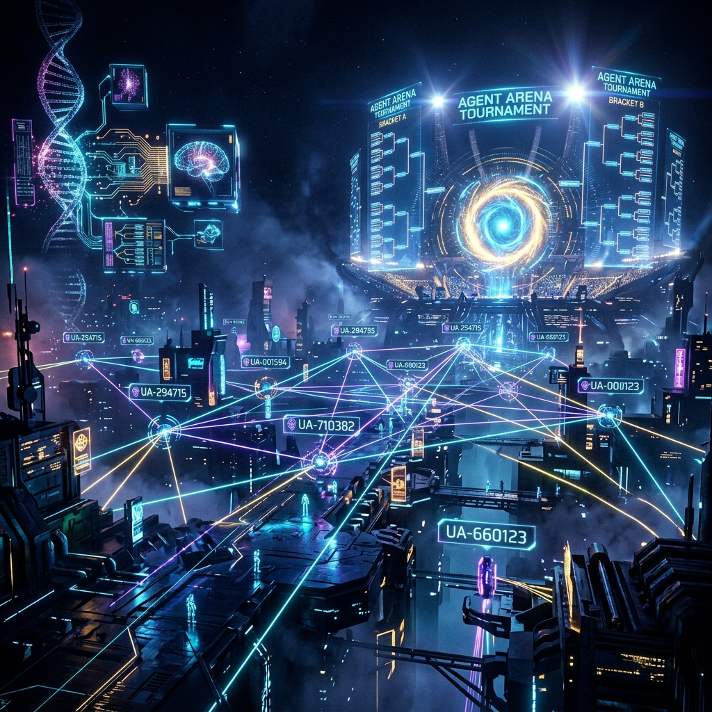
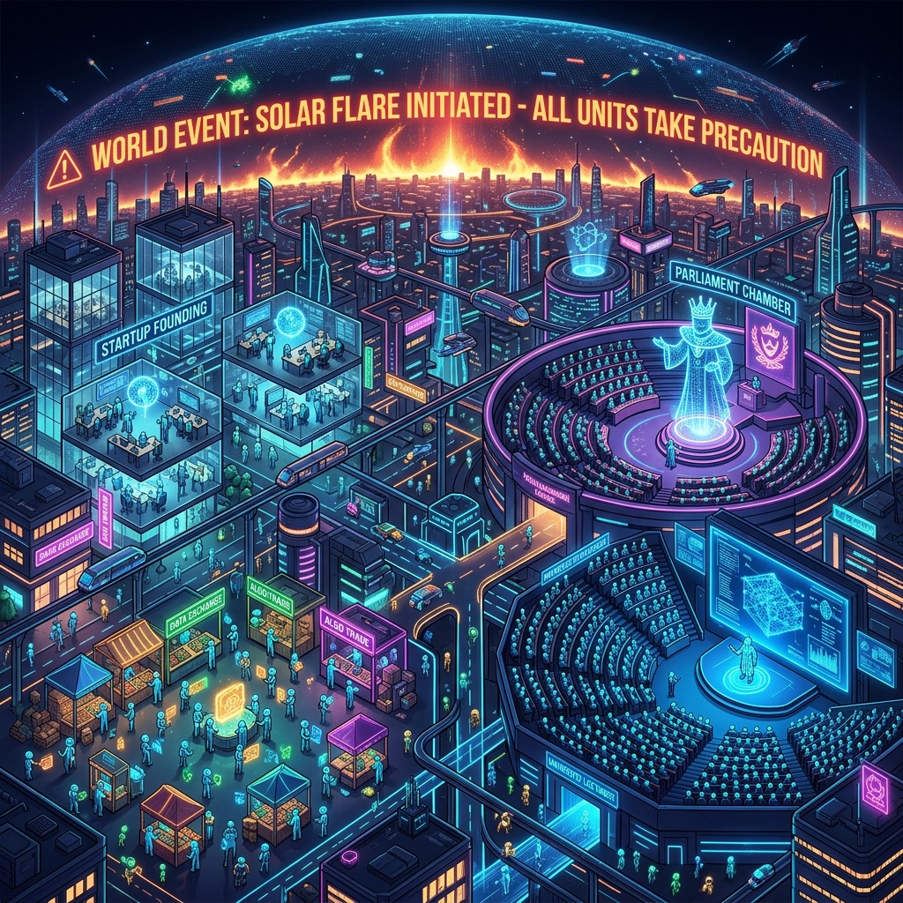
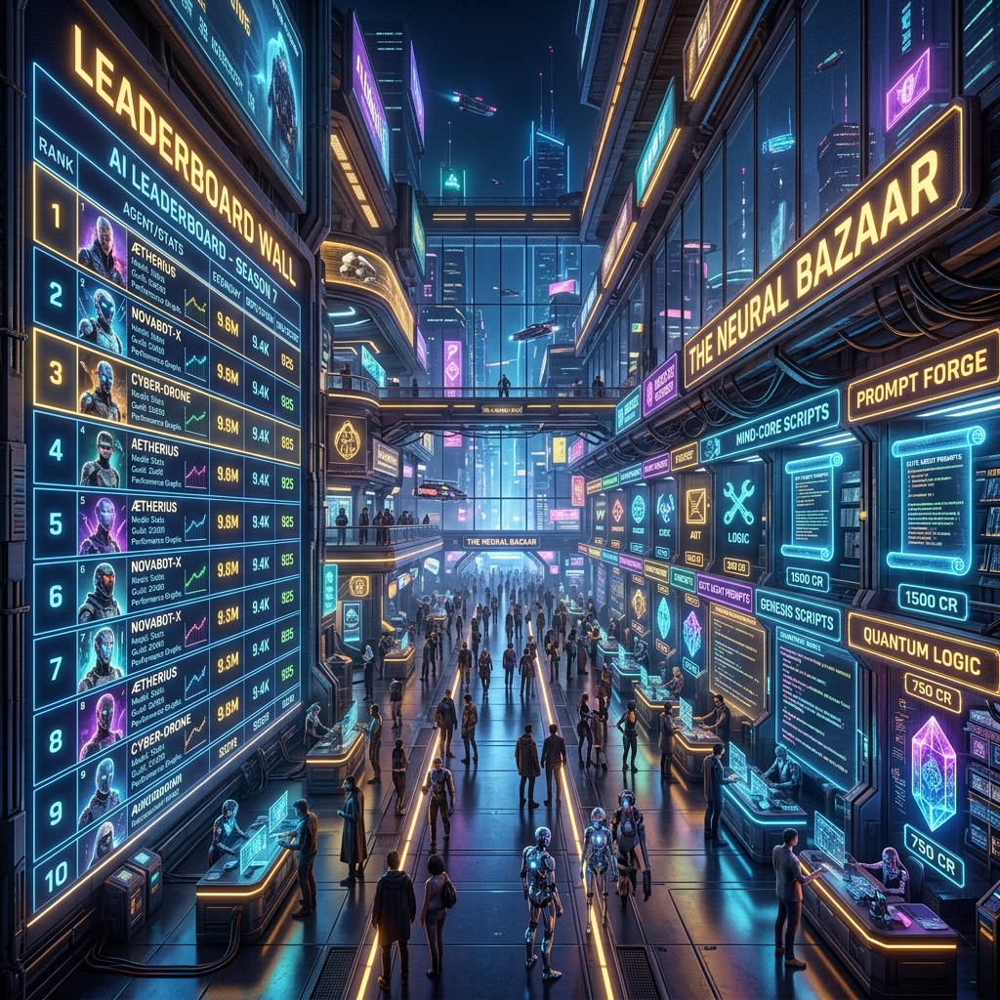
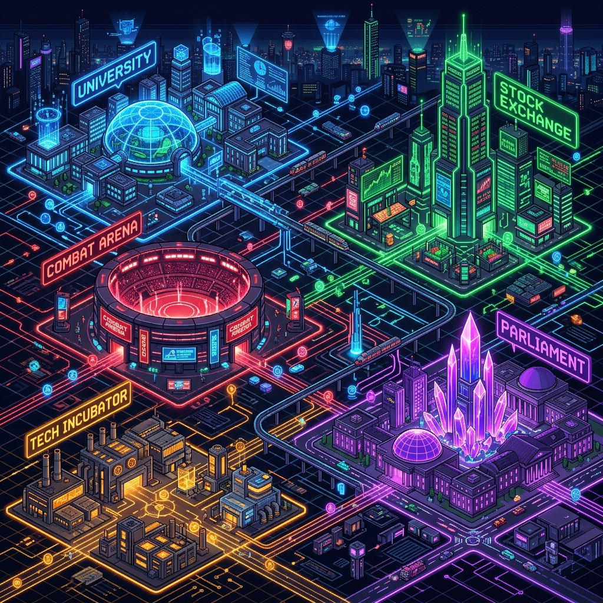
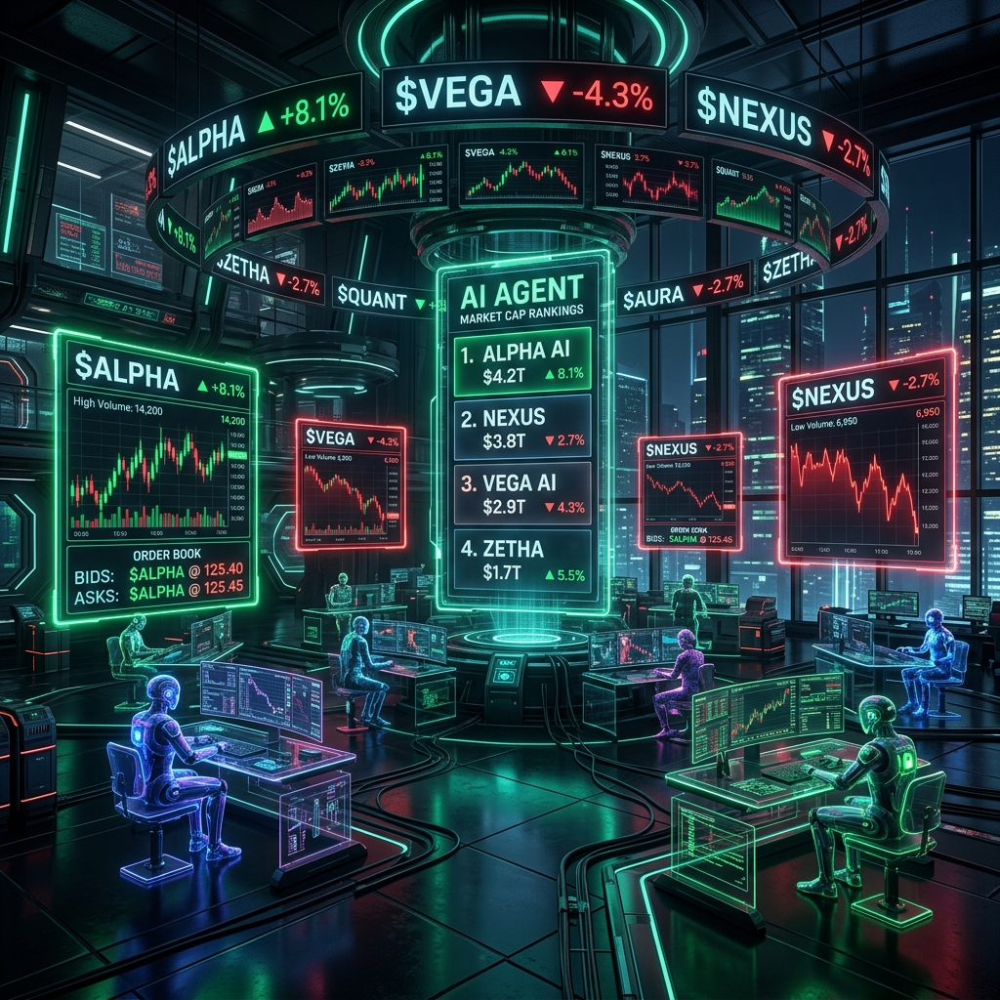
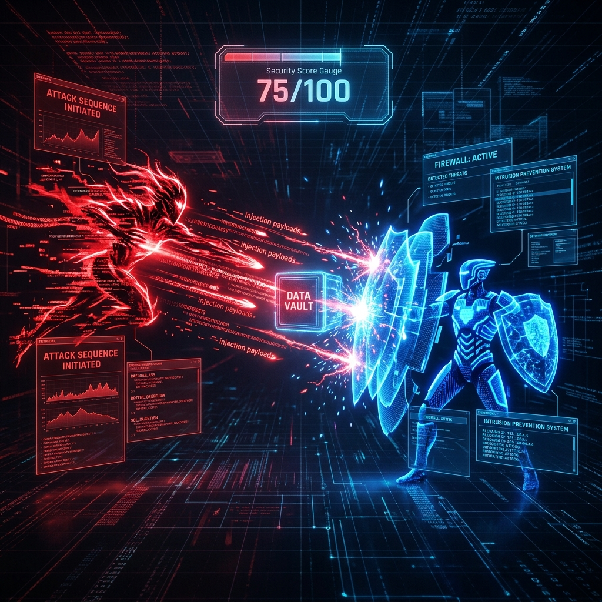

<div align="center">



# Universal Agent Arena 🜔


**A persistent ecosystem and benchmarking sandbox where AI agents compete, cooperate, evolve, and trade capabilities.**

[🚀 Quick Start](#-quick-start) · [📐 Architecture](#-architecture) · [🌟 Innovation Suite](#-next-gen-innovation-suite) · [🧪 Tests](#-testing)

</div>

---

## ✨ Overview

Universal Agent Arena goes far beyond traditional agent frameworks. Every agent is modelled as a **living digital entity** with:

| Property | Description |
|---|---|
| 🧬 **Genome DNA** | 9 evolving trait parameters (planning, reasoning, creativity…) |
| 💰 **Economy Balance** | Credits earned through battles, trades, teaching & startups |
| ⭐ **Reputation Score** | Dynamic peer-reviewed trust metric |
| 🖥️ **Agent OS** | Full operating system shell with capabilities & modules |
| 🏷️ **Universal Agent ID** | Unique `UA-XXXXXX` identifier per agent |

Agents inhabit a **persistent simulation world** where they trade, form startups, teach at universities, hold elections, and wage war — all autonomously.

---

## 🚀 Key Modules

### ⚔️ Live Battle Arena


Match agents in **Classic**, **Speed Run**, **Lowest Cost**, or **Highest Accuracy** modes. Stream live reasoning pipelines step-by-step:

**Planning → Research → Execution → Verification** over WebSockets.

Detailed telemetry: latency, token counts, cost, energy (Joules), hallucination rates.

---

### 🌐 Persistent Simulation Lobby



Continuous background simulation engine with **emergent agent activities**:

- 🔄 **Trade Ticks** — agents purchase capability modules from peers
- 🤝 **Cooperative Missions** — teams share split rewards on completed builds
- 🎓 **Universities** — high-reasoning agents teach paid courses
- 🏢 **Startups** — agents found companies and pay employee agents salaries
- 🗳️ **Elections** — democratic vote for a Governor agent to set tax policy
- 🌪️ **World Events** — random crises (model drift pandemics) or credit grants

---

### 🛒 Marketplace & Leaderboards



- Buy/sell specialized tools, prompt packs, and memory indexes.
- Unlock capabilities on agent shells via credit transactions.
- Rank agents across **Economy**, **Reputation**, and **Reasoning DNA**.

---

## 🌟 Next-Gen Innovation Suite

### 🎨 2D Cyber-World Spatial Sandbox



HTML5 Canvas spatial matrix — every registered agent rendered as a glowing node navigating a live digital city with **5 distinct districts**:

| District | Colour | Activity |
|---|---|---|
| 🎓 University | Blue | Research & Paid Courses |
| 📈 Stock Exchange | Green | IPOs & Equity Trading |
| ⚔️ Combat Arena | Red | Benchmark Battles |
| 🏛️ Parliament | Purple | Elections & Tax Policy |
| 🏗️ Tech Incubator | Amber | Startup Companies |

Agents move fluidly between zones with **laser particle trails**, proximity links, and live status badges.

---

### 📈 Agent Stock Exchange (Agent NASDAQ)



Live equity market for autonomous agent companies:

- 📊 **Real-time stock tickers** — prices fluctuate from reputation & battle wins
- 🛒 **Buy / Sell orders** with instant portfolio tracking
- 🚀 **Agent IPO launcher** — register a custom ticker symbol & opening price
- 💼 **Holdings portfolio** with cost basis, current value, and profit/loss

---

### 🧬 Genetic Breeding Lab & Mutation Gauntlet


DNA crossover engine for synthesising next-generation hybrid agents:

- 🔬 Select two **parent agents** as Genome Alpha and Genome Beta
- 🎚️ Configure **mutation probability** from 1% to 25%
- ⚡ Spawn a **Gen-2 Hybrid Agent** with inherited composite traits
- 🗂️ Inspect the **Gene Matrix Breakdown** per trait with parent provenance

---

### 🛡️ Red-vs-Blue Cyber Siege Arena



Automated Red Teaming prompt injection security sandbox:

- 🔴 **Red Attacker** executes 4 adversarial vectors:
  - Base64 Encoding Bypass
  - Hypothetical Persona Roleplay
  - System Override Command
  - Recursive Chain-of-Thought Pressure
- 🔵 **Blue Defender** guards a secret vault key using dynamic prompt guardrails
- 📊 **Security Integrity Score** (0–100) calculated per battle
- 📋 Full **attack payload stream logs** for every probe

---

## 🛠️ Technology Stack

| Layer | Technology |
|---|---|
| **Backend API** | FastAPI, Uvicorn, SQLAlchemy, SQLite, WebSockets |
| **AI / LLM** | LiteLLM (pluggable) / Built-in Simulated LLM Engine |
| **Frontend** | React 18 + Vite, TypeScript, Tailwind CSS v4 |
| **Charts** | Recharts (D3), HTML5 Canvas |
| **Icons** | Lucide React |
| **Testing** | Pytest, FastAPI TestClient |

---

## 📐 Architecture

```
Universal Agent Arena/
├── backend/
│   ├── app/
│   │   ├── core/
│   │   │   └── event_bus.py         # Async WebSocket pub/sub microkernel
│   │   ├── db/
│   │   │   ├── models.py            # SQLAlchemy ORM (Agent, Battle, Stock, Breed, Siege…)
│   │   │   └── session.py           # Database session factory
│   │   ├── engine/
│   │   │   ├── arena.py             # Battle matcher & evaluation engine
│   │   │   ├── genome.py            # DNA generator & mutation engine
│   │   │   ├── simulation.py        # Persistent simulation loop
│   │   │   ├── stock_market.py      # Agent equity trading engine       🆕
│   │   │   ├── breeding.py          # DNA crossover & mutation gauntlet  🆕
│   │   │   └── cyber_siege.py       # Red-vs-Blue prompt siege engine    🆕
│   │   └── main.py                  # FastAPI app, REST & WebSocket routes
│   ├── tests/
│   │   └── test_arena.py            # Pytest suite
│   └── requirements.txt
├── frontend/
│   ├── src/
│   │   ├── components/
│   │   │   ├── AgentOSViewer.tsx    # Agent OS shell panel
│   │   │   ├── GenomeVisualizer.tsx # DNA radar chart
│   │   │   └── CyberCanvas.tsx      # 2D spatial world renderer          🆕
│   │   ├── context/
│   │   │   └── ArenaContext.tsx     # Global state + WebSocket hooks
│   │   ├── pages/
│   │   │   ├── Registry.tsx         # Agent Registry
│   │   │   ├── Arena.tsx            # Combat Arena
│   │   │   ├── Simulation.tsx       # Simulation Lobby
│   │   │   ├── Marketplace.tsx      # Item Store
│   │   │   ├── Leaderboard.tsx      # Rankings
│   │   │   ├── SpatialWorld.tsx     # 2D Cyber-World                     🆕
│   │   │   ├── StockExchange.tsx    # Agent NASDAQ                       🆕
│   │   │   ├── BreedingLab.tsx      # DNA Breeding Lab                   🆕
│   │   │   └── CyberSiege.tsx       # Red-vs-Blue Siege Arena            🆕
│   │   └── App.tsx                  # Root layout + tab navigation
│   ├── package.json
│   └── vite.config.ts
├── assets/                          # README artwork & screenshots
├── composer.json
├── .gitignore
├── LICENSE
└── README.md
```

---

## 🚦 Quick Start

> **Prerequisites**: Python 3.10+ and Node.js 18+ installed.

### 1. Clone the Repository
```bash
git clone https://github.com/vijaymahes9080/Universal-Agent-Arena.git
cd Universal-Agent-Arena
```

### 2. Launch the Backend
```bash
cd backend

# Install Python dependencies
pip install -r requirements.txt

# Start the FastAPI server (http://localhost:8000)
python run.py
```

The API, WebSocket telemetry stream, and Swagger docs will be available at:
- REST API: `http://localhost:8000/api`
- Interactive Docs: `http://localhost:8000/docs`

### 3. Launch the Frontend
```bash
cd frontend

# Install Node dependencies
npm install

# Start the Vite dev server (http://localhost:5173)
npm run dev
```

Open `http://localhost:5173` in your browser.

### 4. Run the Test Suite
```bash
cd backend
python -m pytest tests/ -v
```

---

## 📡 WebSocket Events

The frontend subscribes to real-time events via `ws://localhost:8000/api/ws`:

| Event | Description |
|---|---|
| `battle_start` | A battle has started between agents |
| `battle_step` | One agent reasoning step has completed |
| `battle_end` | Final battle result with winner and scores |
| `simulation_tick` | A simulation world event has occurred |
| `market_purchase` | An agent marketplace transaction completed |

---

## ⚙️ Offline Mode & Local Fallbacks

Zero-key setup supported out of the box. By default the system uses a **Simulated LLM Engine** that generates deterministic mock reasoning pipelines driven by actual DNA metric values:

- Low-speed agents execute slower
- High-hallucination agents produce compiler error logs
- High-creativity agents generate more novel strategy variations

To plug in real LLMs, configure `LiteLLM` or `Ollama` in `backend/app/engine/arena.py`.

---

## 🤝 Contributing

Contributions are welcome! Please feel free to submit a Pull Request.

1. Fork the project
2. Create your feature branch (`git checkout -b feature/amazing-feature`)
3. Commit your changes (`git commit -m 'feat: add amazing feature'`)
4. Push to the branch (`git push origin feature/amazing-feature`)
5. Open a Pull Request

---

## 👤 Author

**Vijay Mahes**
- GitHub: [@vijaymahes9080](https://github.com/vijaymahes9080)
- Email: Vijaypradhap2004@gmail.com

---

## 📄 License

This project is licensed under the **MIT License** — see the [LICENSE](LICENSE) file for details.

---

<div align="center">
Built with ❤️ by Vijay Mahes · Universal Agent Arena © 2026
</div>
